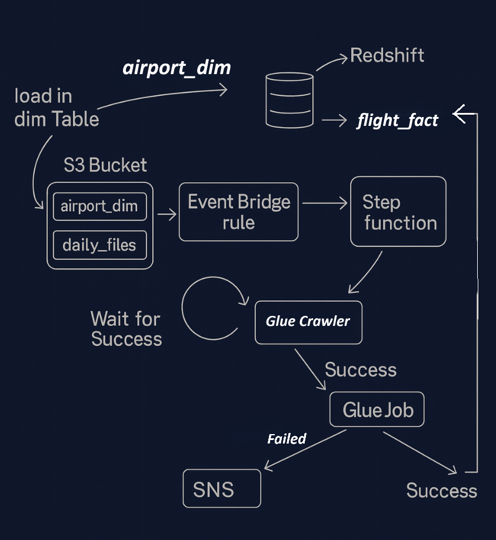
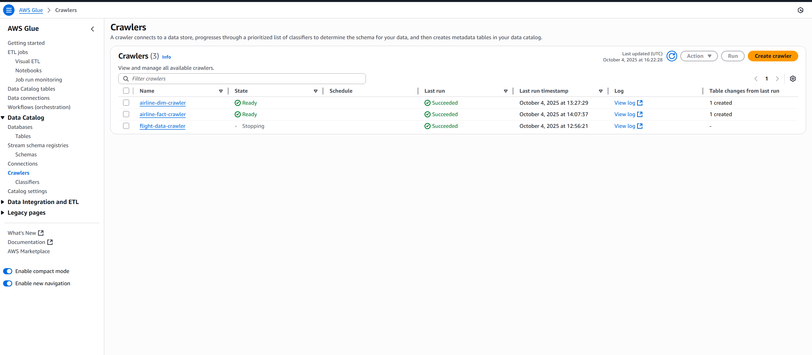
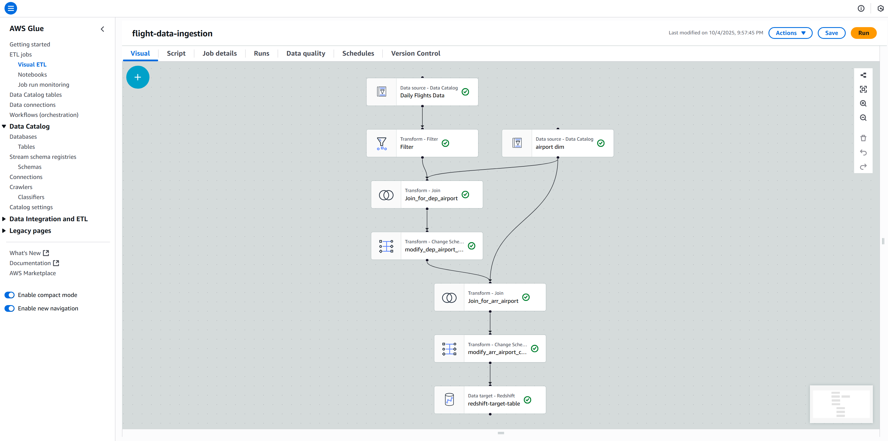
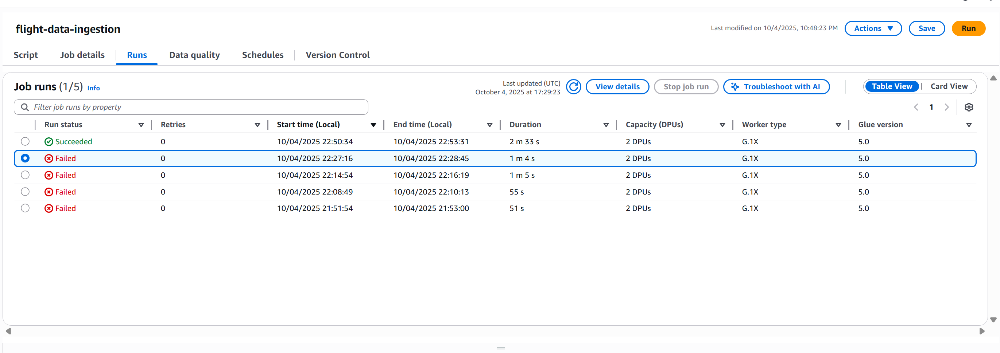
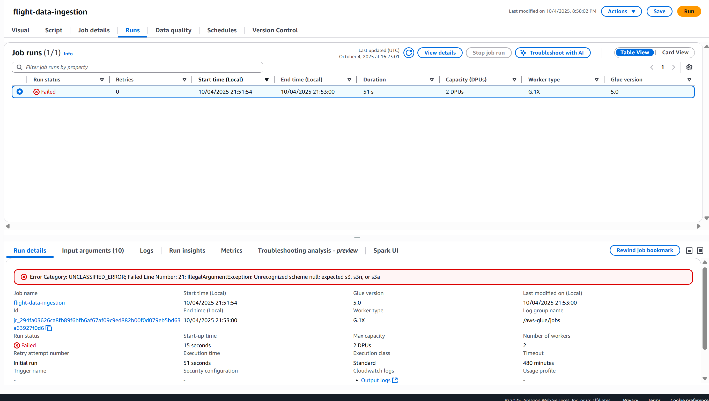
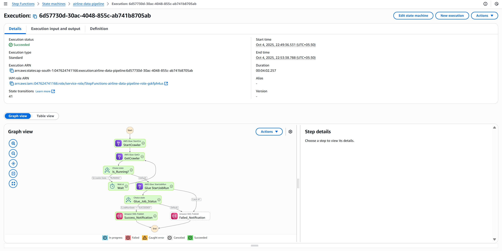
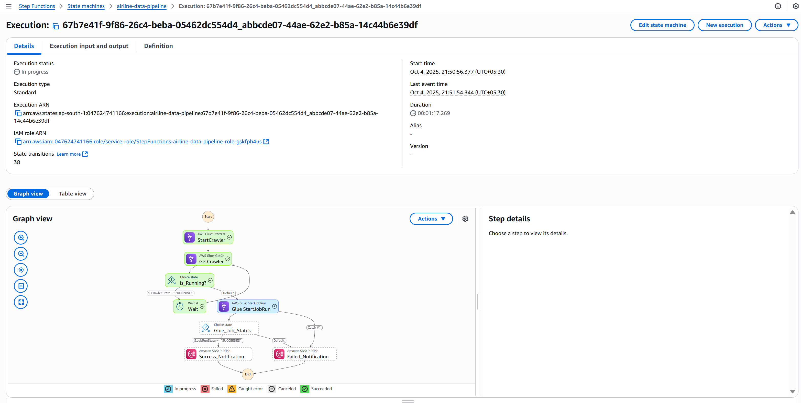
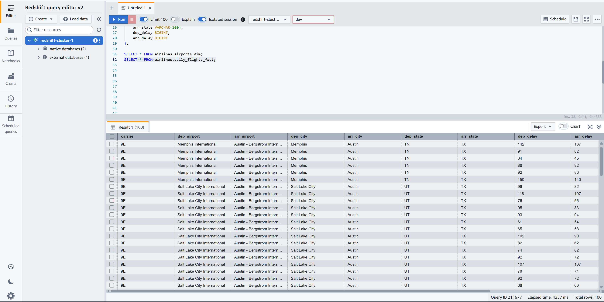
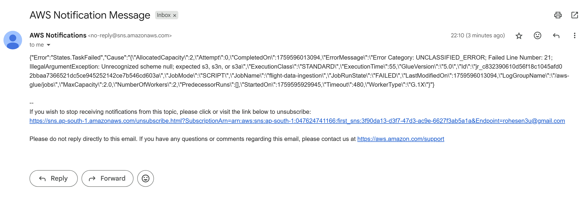

# ✈️ Airline Data Ingestion using AWS


## 📘 Project Overview
This project automates the ingestion and transformation of **airline flight data** using a **serverless AWS data pipeline**.  
The system processes daily flight information, enriches it with airport dimension data, and loads the final dataset into **Amazon Redshift** for analytics and reporting.

---

## 🧱 Architecture Flow

1. **S3** – Stores both the dimension (`airport_dim`) and daily flight files.  
2. **EventBridge** – Detects new file uploads in S3 and triggers the workflow.  
3. **Step Functions** – Orchestrates the end-to-end pipeline execution.  
4. **Glue Crawler** – Scans and updates the Glue Catalog metadata.  
5. **Glue Job** – Transforms and loads enriched data into Redshift.  
6. **Redshift** – Serves as the central data warehouse.  
7. **SNS** – Sends notifications for success or failure events.

   
---

## 📂 Data Description

### 🧩 `airport.csv` — Dimension Table
Contains airport master data.

| Column Name | Description |
|--------------|--------------|
| `airport_id` | Unique ID for each airport |
| `city` | City of the airport |
| `state` | U.S. state code |
| `name` | Full airport name |

**Sample:**
```csv
airport_id,city,state,name
10165,Adak Island,AK,Adak
10299,Anchorage,AK,Ted Stevens Anchorage International
10304,Aniak,AK,Aniak Airport
````

---

### ✈️ `flight.csv` — Fact Table

Daily flight operational data.

| Column Name       | Description               |
| ----------------- | ------------------------- |
| `Carrier`         | Airline code              |
| `OriginAirportID` | Origin airport ID         |
| `DestAirportID`   | Destination airport ID    |
| `DepDelay`        | Departure delay (minutes) |
| `ArrDelay`        | Arrival delay (minutes)   |

**Sample:**

```csv
Carrier,OriginAirportID,DestAirportID,DepDelay,ArrDelay
DL,11433,13303,-3,1
DL,14869,12478,0,-8
DL,14057,14869,-4,-15
```

---

## ⚙️ AWS Services Used

| AWS Service         | Purpose                                |
| ------------------- | -------------------------------------- |
| **Amazon S3**       | Raw data lake for staging input files  |
| **EventBridge**     | Detects new data and triggers pipeline |
| **Step Functions**  | Orchestration of Glue Crawler and Job  |
| **AWS Glue**        | Crawler (for metadata) + Job (for ETL) |
| **Amazon Redshift** | Target Data Warehouse                  |
| **SNS**             | Notification service for job status    |

---

## 🧩 Project Components

### 🗂️ 1. EventBridge Rule

Defined in `event_bridge_rule.json` – triggers Step Functions when new `.csv` file arrives in S3.

### 🧠 2. Step Function Definition

File: `step_function_code.json`

* Starts Glue Crawler
* Waits for completion
* Triggers Glue Job
* Publishes success/failure message to SNS

### 🧮 3. Glue Job Script

File: `gluejob.py`

* Reads airport dimension data from Redshift
* Reads flight fact data from S3
* Filters delayed flights (`DepDelay > 60`)
* Joins with airport dimension table for enrichment
* Loads the output to Redshift fact table `airlines.daily_flights_fact`

### 🏗️ 4. Redshift DDL Commands

File: `redshift_create_table_commands.txt`
Creates required schemas and tables for data ingestion.

---

## 🚀 Pipeline Execution Flow

1. Upload **daily flight CSV** to S3.
2. **EventBridge Rule** triggers **Step Function**.
3. **Step Function** starts **Glue Crawler** → updates Glue Data Catalog.
4. Once completed, it triggers **Glue Job**.
5. **Glue Job** performs transformations and loads enriched data into Redshift.
6. **SNS Notification** sent on success or failure.

---

## 📊 Redshift Schema

### `airlines.airports_dim`

| Column     | Type         |
| ---------- | ------------ |
| airport_id | BIGINT       |
| city       | VARCHAR(100) |
| state      | VARCHAR(100) |
| name       | VARCHAR(200) |

### `airlines.daily_flights_fact`

| Column      | Type         |
| ----------- | ------------ |
| carrier     | VARCHAR(10)  |
| dep_airport | VARCHAR(200) |
| arr_airport | VARCHAR(200) |
| dep_city    | VARCHAR(100) |
| arr_city    | VARCHAR(100) |
| dep_state   | VARCHAR(100) |
| arr_state   | VARCHAR(100) |
| dep_delay   | BIGINT       |
| arr_delay   | BIGINT       |

---

## 🧠 Step Function Logic

| State                    | Description                  |
| ------------------------ | ---------------------------- |
| **StartCrawler**         | Triggers Glue Crawler        |
| **GetCrawler**           | Checks status                |
| **Wait**                 | Waits until crawler finishes |
| **Glue StartJobRun**     | Executes ETL job             |
| **Success_Notification** | Sends SNS success message    |
| **Failed_Notification**  | Sends SNS failure message    |

---

## 🖼️ Project Screenshots

### 1️⃣ Blank Initial State (No Data in Redshift)


### 2️⃣ Glue Crawler Setup



### 3️⃣ Glue Job Visual Overview



### 4️⃣ Successful Glue Job Run



### 5️⃣ Failed Glue Job Run



### 6️⃣ Step Function Successful Execution



### 7️⃣ Step Function Failed Execution



### 8️⃣ Final Loaded Flight Data in Redshift



### 9️⃣ AWS SNS Notification (Success)


### 🔟 AWS SNS Notification (Failure)



---

## 🔔 Notifications

AWS **SNS** sends email alerts on Glue Job completion:

* ✅ **Success:** `"Glue Job Execution Successful !!"`
* ❌ **Failure:** Detailed error payload

---

## 🧠 Key Learnings

* Serverless ETL using **AWS Glue**
* Event-driven workflow via **S3 + EventBridge**
* Automated orchestration using **Step Functions**
* Data Warehouse integration with **Redshift**
* Real-time monitoring using **SNS**

---

## 👨‍💻 Author

**Rohesen**
📦 [GitHub Repository](https://github.com/Rohesen/Airline_Data_Ingestion_using_AWS.git)
